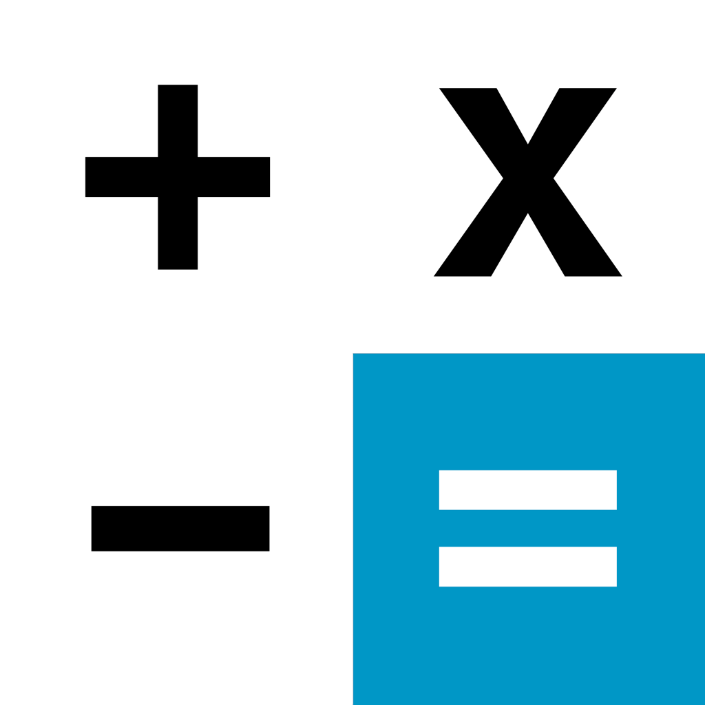

# [Calculator](https://play.google.com/store/apps/details?id=com.gamitopia.calculator)

## Description

[Calculator](https://play.google.com/store/apps/details?id=com.gamitopia.calculator) is a mobile app made for Android with Ionic Angular. It includes a calculator, many unit converters, a tool for creating charts, a graphing calculator and more. It is customizable yet simple and has many light and dark color themes.

[You can download Calculator from the Google Play store here](https://play.google.com/store/apps/details?id=com.gamitopia.calculator)

## Project structure

Below is a quick overview of some of the most important folders and files (excluding most config files and some small files).

### src/app/

**app/** contains all components, logic and data. Each component has it's own folder with four to six files (.component.html, .component.scss, .component.spec.ts, .service.spec.ts, .service.ts).  
**app/calculator/** contains the actual components and logic of the app.  
**app/common/** contains commonly used components.  
**app/models/** contains custom interfaces and types.

### src/

**assets/** contains images and other assets.  
**environments/** contains config options for different environments (dev and prod).

**index.html** is the HTML page that will be served. Angular automatically injects the components, TS and CSS to it using the `<app-root></app-root>` component.  
**main.ts** is the main entry point for the application and it bootstraps the root module (AppModule).  
**polyfills.ts** has polyfills for better browser support.  
**/theme/variables.scss** contains the CSS variables that affect the color themes.  
**global.scss** has global styles and CSS variable imports.

### android/

Contains the Android build.

### resources/

Contains the icons and splashscreens.
